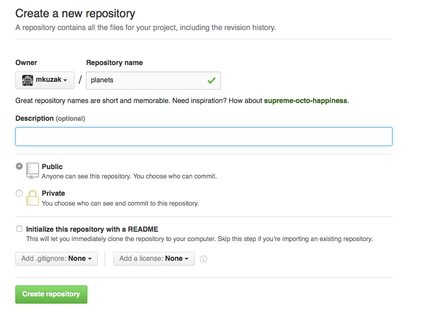
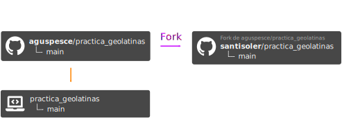
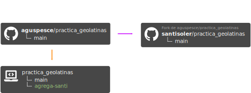
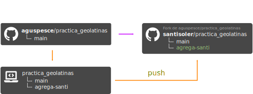
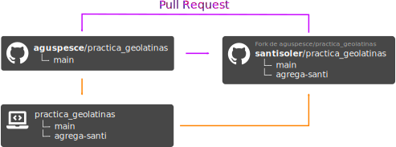

<!-- .slide: class="slide-title" -->

<div class="vertical">

<div class="title">
<h1>Introducción a Git</h1>
</div>

## [Santiago Soler](https://santisoler.github.io)

[*CONICET, Argentina*](https://www.conicet.gov.ar/)
<br>
[*Instituto Geofísico y Sismológico Volponi, UNSJ, Argentina*](http://igsv.unsj.edu.ar/)
<br>
[*Computer-Oriented Geoscience Lab*](https://www.compgeolab.org/)

<div class="container logos">
<div class="logo">
<a href="https://www.conicet.gov.ar/">

</a>
</div>
<div class="logo">
<a href="http://igsv.unsj.edu.ar/">

</a>
</div>
<div class="logo">
<a href="https://www.compgeolab.org/">

</a>
</div>
</div>

</div>

---

Pueden ver las slides en:


https://santisoler.github.io/git-intro-geolatinas

<p class="license-icons">
<i class="fab fa-creative-commons"></i><i class="fab fa-creative-commons-by"></i>
</p>

---

# Recursos

- [Software Carpentry Lesson](https://swcarpentry.github.io/git-novice)
- [Git Workflow](https://www.asmeurer.com/git-workflow/)
- [Pro Git (libro)](https://git-scm.com/book/en/v2)
- [Te lo explico con gatitos](https://teloexplicocongatitos.com/poster/tlecg04)

---

# ¿Qué es Git?

<h2 class="fragment">
Software de control de versiones
</h2>

<p class="emoji fragment">
🤨
</p>

---


<div class="bottom">
<a href="http://phdcomics.com/comics/archive.php?comicid=1531">
"Piled Higher and Deeper" by Jorge Cham
</a>
</div>

---

## Añadir cambios


----

## Crear diferentes versiones


----

## Incorporar cambios de dos versiones


---

# ¿Cómo funciona?

- Repositorio
- Ramas
- Commits

---

# Git Workflow

<div class="r-stack">


</div>

---

# GIT

<div class="container" style="align-items: center;">

<div class="col-4">

</div>
<div class="column">
<h1 class="fragment">+</h1>
</div>
<div class="col-4">

</div>

</div>

---

# Ventajas de Git

- Distribuido
- Open-source
- Historia completa
- Facilita la colaboración
- Servidores gratuitos para repositorios

---


---

Primero veamos cómo usar Git...

---

# Instalar git

[Instrucciones de Software Carpentry](https://carpentries.github.io/workshop-template/#setup)

<div class="container" style="margin-top: 10vh;">
<div class="column">

## Windows

[Git for Windows](https://gitforwindows.org/)

</div>
<div class="column">

## Mac OS

[git-osx-installer](https://sourceforge.net/projects/git-osx-installer/files/)

</div>
<div class="column">

## Linux

Gestor de paquetes.

</div>
</div>

---

# Configuración básica

```bash
$ git config --global user.name "Marie Tharp"
$ git config --global user.email "marie_tharp@umich.edu"
```

---

# Crear un repositorio

```bash
$ mkdir mi_repositorio
$ cd mi_repositorio
$ git init
```

---

# Hacer un commit


---

# Hacer un commit

<ol>
<li class="fragment fade-in">Creamos o modificamos uno o más archivos</li>
<li class="fragment fade-in">
Agregamos los cambios a stage area

```bash
$ git add .
```

</li>
<li class="fragment fade-in">
Creamos el commit

```bash
$ git commit
```

</li>
</ol>

</div>

---

# Comandos útiles

1. Ver el estado del repositorio
    ```bash
    $ git status
    ```
2. Ver el historial de la rama
    ```bash
    $ git log
    ```
3. Ver diferencias en el working directory
    ```bash
    $ git diff
    ```

---

# NOTA

- La rama que Git crea por defecto se suele llamar `master`.
- `master` posee connotaciones negativas.
- GitHub la renombra a `main` a partir del 1ero de Octubre de 2020.

Pueden cambiarla en sus computadoras con:

```
$ git config --global init.defaultBranch main
```

---

# Crear una nueva rama

<div class="r-stack">
<ol class="fragment current-visible">

1. Crear una nueva rama
    ```bash
    $ git branch nueva_rama
    ```
2. Movernos a esa rama
    ```bash
    $ git checkout nueva_rama
    ```

</ol>

<div class="fragment current-visible">

O podemos usar el nuevo comando 🚀

```bash
$ git switch --create nueva_rama
```
</div>
</div>

---

# Merge

Queremos mergear la `nueva_rama` en `main`.

1. Nos movemos a `main`:
    ```bash
    $ git switch main
    ```
2. Traemos los cambios de `nueva_rama` a `main`:
    ```bash
    $ git merge nueva_rama
    ```

---

Ahora sí, veamos cómo trabajar en


---

Pero primero, un descanso...

☕ 🥤 🧉 🍵 🥛 🍷 🍺

---


- Nos permite almacenar repositorios "en la nube"
- Facilita la colaboración
- Issues y PullRequests
- Mucho más:
    - Code review
    - Releases
    - Continuous Integration
    - GitHub Pages

---

# Por ejemplo

https://github.com/aguspesce/practica_geolatinas

---

# Crear un repositorio en GitHub

<div class="r-stack">


</div>

---

# Subir cambios a GitHub

<div class="r-stack">


</div>

---


# Subir cambios a GitHub

1. Agrego dirección de repo de GitHub bajo el nombre `origin`:
    ```bash
    $ git remote add origin DIRECCION
    ```
2. Verificamos que esté bien configurado
    ```bash
    $ git remote -v
    ```
3. Subimos los cambios al repositorio de  GitHub
    ```bash
    $ git push origin main
    ```

----

Asociar rama local con rama remota

```bash
$ git push --upstream origin main
```

---

# Descargar cambios desde GitHub


Podemos usar `git pull`:

```bash
$ git pull origin main
```

Si nuestra rama está asociada, podemos simplificarlo:
```bash
$ git pull
```

---

# ¿Cómo colaborar?

<div class="r-stack">






</div>

---

# ¿Cómo colaborar?

1. Descargamos el repositorio
    ```bash
    $ git clone https://github.com/aguspesce/practica_geolatinas
    ```
2. Hacemos un Fork desde GitHub
3. Agregamos el remote de nuestro fork
    ```bash
    $ git remote add santisoler https://github.com/santisoler/practica_geolatinas
    ```

----

4. Creamos una nueva rama
    ```bash
    $ git switch --create agrega-santi
    ```
5. Realizamos cambios y agregamos commits
    ```bash
    $ git add .
    $ git commit
    ```
6. Subimos nuestros cambios a nuestro fork
    ```bash
    $ git push --upstream santisoler agrega-santi
    ```
7. Abrimos un PullRequest desde GitHub

---

# Consejos y recomendaciones

- Contribuciones != Código
- Código de Conducta
- Licencia de Software
- Canales de comunicación


---

# Cosas de Interés

- [Hacktoberfest 2020](https://hacktoberfest.digitalocean.com/)
- [Fatiando a Terra](https://www.fatiando.org)
- [Software Underground](https://softwareunderground.org/)
- [Journal of Open Source Software](https://joss.theoj.org/)

---

# Contacto

<div>

<ul class="fa-ul" style="">
<li><i class="fa-li fa fa-envelope"></i>

[santiago.r.soler@gmail.com](mailto:santiago.r.soler@gmail.com)

</li>
<li><i class="fa-li fab fa-twitter"></i>

[@santirsoler](https://twitter.com/santirsoler)

</li>
<li><i class="fa-li fa fa-globe-americas"></i>

[santisoler.github.io](https://santisoler.github.io)

</li>
</ul>

</div>

---

<!-- .slide: class="slide-license" -->

<p class="license-icons">
<i class="fab fa-creative-commons"></i><i class="fab fa-creative-commons-by"></i>
</p>

El contenido de esta presentación está disponible bajo

[Creative Commons Attribution 4.0 International License](https://creativecommons.org/licenses/by/4.0/)

---

<!-- .slide: class="slide-title" -->

# Muchas gracias
