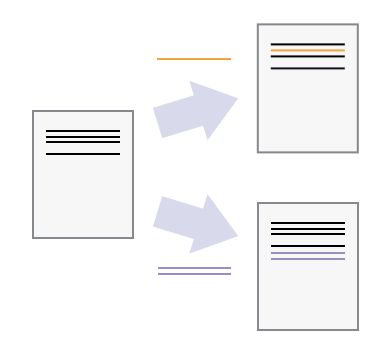
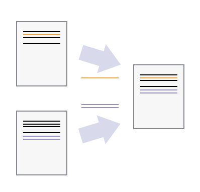
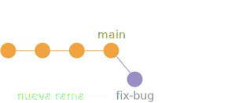
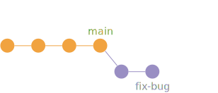
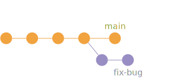
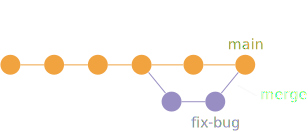
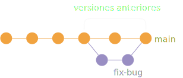
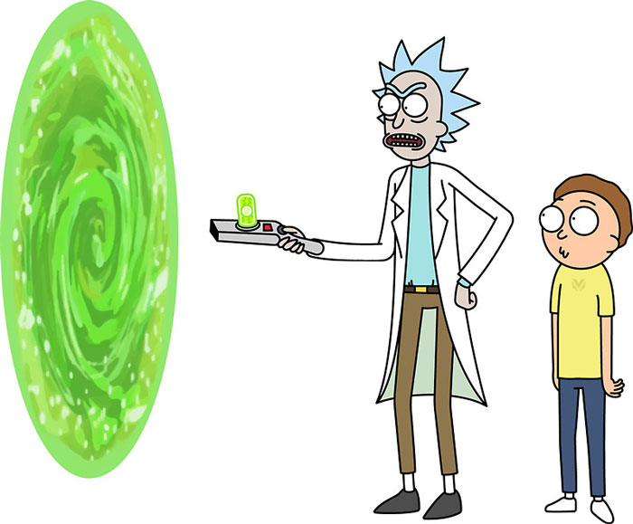
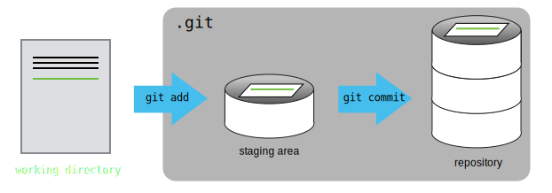

<!-- .slide: class="slide-title" -->

<div class="vertical">

<div class="title">
<h1>Introducción a Git</h1>
</div>

## [Santiago Soler](https://santisoler.github.io)

[*CONICET, Argentina*](https://www.conicet.gov.ar/)
<br>
[*Instituto Geofísico y Sismológico Volponi, UNSJ, Argentina*](http://igsv.unsj.edu.ar/)
<br>
[*Computer-Oriented Geoscience Lab*](https://www.compgeolab.org/)

<div class="container logos">
<div class="logo">
<a href="https://www.conicet.gov.ar/">

</a>
</div>
<div class="logo">
<a href="http://igsv.unsj.edu.ar/">

</a>
</div>
<div class="logo">
<a href="https://www.compgeolab.org/">

</a>
</div>
</div>

</div>

---

Pueden ver las slides en:


https://santisoler.github.io/git-intro-geolatinas

<p class="license-icons">
<i class="fab fa-creative-commons"></i><i class="fab fa-creative-commons-by"></i>
</p>

---

# Recursos

- [Software Carpentry Lesson](https://swcarpentry.github.io/git-novice)
- [Pro Git (libro)](https://git-scm.com/book/en/v2)
- [Git Workflow](https://www.asmeurer.com/git-workflow/)
- [Te lo explico con gatitos](https://teloexplicocongatitos.com/poster?id=tlecg04)

---

# ¿Qué es Git?

<h2 class="fragment">
Software de control de versiones
</h2>

<p class="emoji fragment">
🤨
</p>

---


<div class="bottom">
<a href="http://phdcomics.com/comics/archive.php?comicid=1531">
"Piled Higher and Deeper" by Jorge Cham
</a>
</div>

---

## Añadir cambios


---

## Crear diferentes versiones



---

## Incorporar cambios de dos versiones



---

# ¿Cómo funciona?

- Repositorio
- Ramas
- Commits

---

# Git Workflow

<div class="r-stack">







</div>

---

# GIT

<div class="container" style="align-items: center;">

<div class="col-4">

</div>
<div class="column">
<h1 class="fragment">+</h1>
</div>
<div class="col-4">

</div>

</div>

---

# Ventajas de Git

- Distribuido
- Open-source
- Historia completa
- Facilita la colaboración
- Servidores gratuitos para repositorios

---


---

Primero veamos cómo usar Git...

---

# Instalar git

https://git-scm.com/book/en/v2/Getting-Started-Installing-Git

ó

https://desktop.github.com/

---

# Configuración básica

```bash
$ git config --global user.name "Marie Tharp"
$ git config --global user.email "marie_tharp@umich.edu"
```

---

# Crear un repositorio

```bash
$ mkdir mi_repositorio
$ cd mi_repositorio
$ git init
```

---

# Hacer un commit




---

# Hacer un commit

<ol>
<li class="fragment fade-in">Creamos o modificamos uno o más archivos</li>
<li class="fragment fade-in">
Agregamos los cambios a stage area

```bash
$ git add .
```

</li>
<li class="fragment fade-in">
Creamos el commit

```bash
$ git commit
```

</li>
</ol>

</div>

---

# Comandos útiles

1. Ver el estado del repositorio
    ```bash
    $ git status
    ```
2. Ver el historial de la rama
    ```bash
    $ git log
    ```
3. Ver diferencias en el working directory
    ```bash
    $ git diff
    ```

---

# Crear una nueva rama

1. Crear una nueva rama
    ```bash
    $ git branch nueva_rama
    ```
2. Movernos a esa rama
    ```bash
    $ git checkout nueva_rama
    ```

---


# Regular slide

## With subtitles

---

# Do you want columns?

<div class="container">

<div class="column">

</div>

<div class="col-2">
<div class="centered">

* Licenciado en Física (UNR)
* Estudiante de Doctorado en Geofísica (UNSJ)
* Becario Doctoral de CONICET
* Desarrollador de [Fatiando a Terra](https://www.fatiando.org)
* Miembro de [Computer-Oriented Geoscience Lab](https://www.compgeolab.org)

</div>
</div>

</div>

---

# You can add fade-in animations

<div class="container">

<div class="column fragment fade-in">

First element

</div>

<div class="column fragment fade-in">

Second element

</div>

</div>

---

## Even on lists

<ul>
<li class="fragment fade-in">First element</li>
<li class="fragment fade-in">Second element</li>
<li class="fragment fade-in">Third element</li>
</ul>

---

## Highlight current item on list

<ol>
<li class="fragment highlight-current-blue">First element</li>
<li class="fragment highlight-current-blue">Second element</li>
<li class="fragment highlight-current-blue">Third element</li>
</ol>

---

# You can put footnotes

<div class="bottom">

https://www.blog.pythonlibrary.org/2019/04/11/python-used-to-take-photo-of-black-hole/

</div>

---

<!-- .slide: data-background-color="#FAFAFA" -->

## You can change the background color

---

## Add quotes

<blockquote>
This is a quote
</blockquote>

---

# Contacto

<div>

<ul class="fa-ul" style="">
<li><i class="fa-li fa fa-envelope"></i>

[santiago.r.soler@gmail.com](mailto:santiago.r.soler@gmail.com)

</li>
<li><i class="fa-li fab fa-twitter"></i>

[@santirsoler](https://twitter.com/santirsoler)

</li>
<li><i class="fa-li fa fa-globe-americas"></i>

[santisoler.github.io](https://santisoler.github.io)

</li>
</ul>

</div>

---

<!-- .slide: class="slide-license" -->

<p class="license-icons">
<i class="fab fa-creative-commons"></i><i class="fab fa-creative-commons-by"></i>
</p>

El contenido de esta presentación está disponible bajo

[Creative Commons Attribution 4.0 International License](https://creativecommons.org/licenses/by/4.0/)

---

<!-- .slide: class="slide-title" -->

# Muchas gracias
